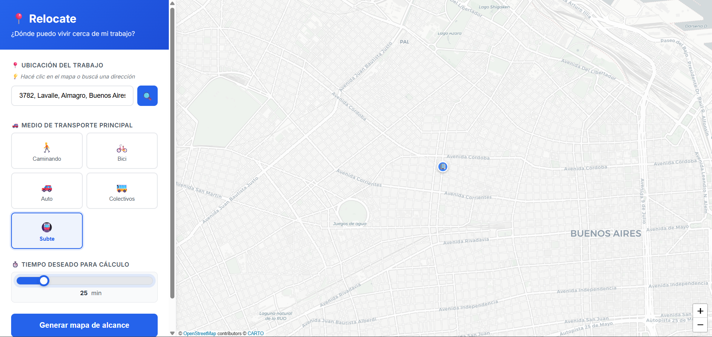
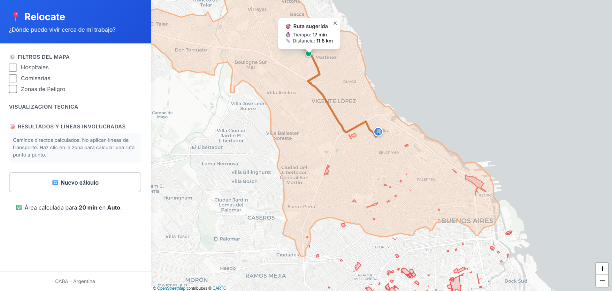
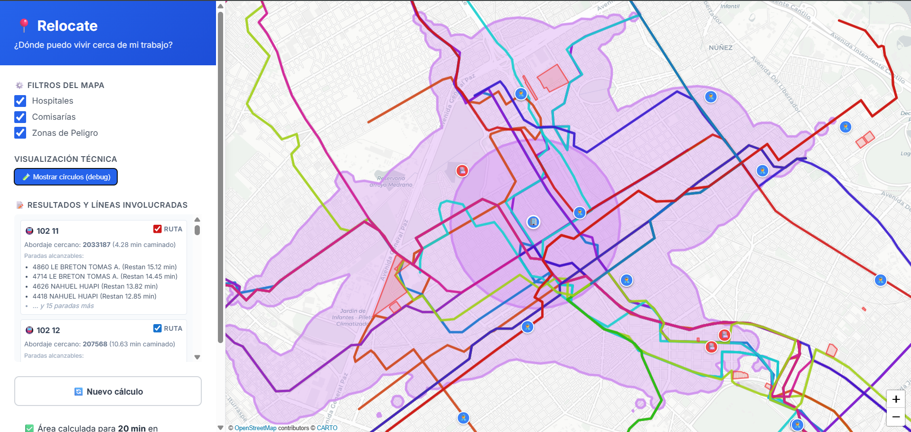
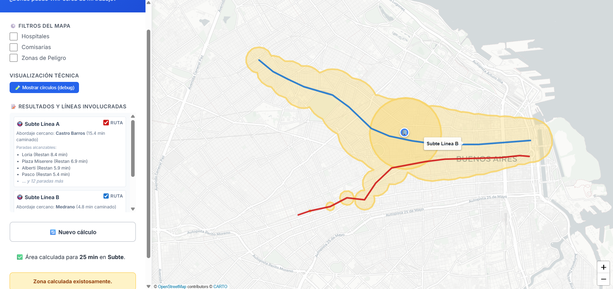

# 🗺️ Relocate - Mapa de Alcance CABA

Herramienta visual que permite ver hasta dónde se puede vivir razonablemente según el lugar de trabajo y el medio de transporte elegido.


## 📸 Demo de Pantallas

**Pantalla Inicial (Búsqueda)**


**Resultado Viajando en Auto**


**Resultado Viajando en Colectivo**


**Resultado Viajando en Subte**



## ✨ Funcionalidades Principales

- 🖱️ **Flujo de Dos Etapas** - Interfaz dividida en configuración inicial visual y panel de resultados detallado.
- 🔍 **Búsqueda por dirección** o un simple clic en el mapa (Geocodificación con Proxy de Nominatim).
- 🚗 **Múltiples medios de transporte**: Caminar, Bicicleta, Auto, Transporte Público (Subte y Colectivos).
- ⏱️ **Tiempos configurables**: Deslizador interactivo para elegir el tiempo máximo.
- 🎯 **Isócronas visuales precisas** - Algoritmo propio para transporte público usando datos reales de paradas GTFS.
- 🚇 **Desglose de Rutas** - Muestra las líneas de transporte utilizadas y permite activarlas o desactivarlas individualmente en el mapa.
- 🛡️ **Filtros de Interés** - Capas adicionales para ver Comisarías, Hospitales y Zonas de Peligro (Barrios Populares).

## 🚀 Instalación Rápida

### 1. Clonar y entrar al directorio

```bash
cd relocate-app
```

### 2. Crear entorno virtual (recomendado)

```bash
python -m venv venv

# Windows:
venv\Scripts\activate

# macOS/Linux:
source venv/bin/activate
```

### 3. Instalar dependencias

```bash
pip install -r requirements.txt
```

### 4. Configurar API Key (opcional para demo)

Para obtener isócronas reales, necesitas una API key gratuita de OpenRouteService:

1. Regístrate en: https://openrouteservice.org/dev/
2. Copia el archivo de ejemplo:
   ```bash
   cp .env.example .env
   ```
3. Edita `.env` y agrega tu API key:
   ```
   ORS_API_KEY=tu_api_key_aqui
   ```

> 💡 **Sin API key**, la app funciona en **modo demo** generando polígonos aproximados.

### 5. Ejecutar

```bash
python app.py
```

La aplicación estará disponible en: **http://localhost:5000**

## 📖 Guía de Uso

### 🏠 Etapa 1: Configuración
1. **Seleccioná tu destino (trabajo/estudio)** 
   - Hacé clic directamente en el mapa de fondo.
   - O ingresá la dirección en la barra de búsqueda y presiona enter.
2. **Elegí el medio de transporte** principal (caminar, bici, auto, bus o subte).
3. **Ajustá el tiempo máximo** de viaje usando el deslizador.
4. Hacé clic en **"Calcular Zona"**.

### 🗺️ Etapa 2: Resultados y Análisis
1. **Explorá el área calculada**: El mapa se centrará en el área donde puedes vivir.
2. **Revisá las rutas**: Si elegiste transporte público, en la barra lateral verás un desglose exacto de las líneas involucradas y las paradas alcanzables. Podes usar los checkboxes para encender/apagar el dibujo de su recorrido.
3. **Aplicá Filtros**: Podes superponer hospitales, comisarías o alertas de zonas peligrosas.
4. **Modo Debug**: Un botón en la esquina expone los círculos de alcanzabilidad detrás del motor de geometría.

## 🏗️ Arquitectura del Proyecto

```
relocate-app/
├── app.py              # Backend Flask (Rutas, Cálculo de Isócronas GTFS, API Proxy)
├── requirements.txt    # Dependencias Python
├── data/               # Archivos CSV, JSON y datos GTFS procesados
├── scripts/            # Scripts ETL para procesamiento offline de datos
├── templates/
│   └── index.html      # Frontend HTML (UI de 2 etapas)
└── static/
    ├── css/
    │   └── style.css   # Estilos, Themes y Responsive Design
    └── js/
        ├── main.js      # Orquestador principal y listeners
        ├── api.js       # Comunicación segura con el backend
        ├── config.js    # Constantes, configuraciones de color
        ├── state.js     # Estado centralizado de la aplicación
        ├── ui.js        # Manipulación DOM y actualizaciones visuales
        ├── map-core.js  # Base e inicialización de Leaflet
        └── map-draw.js  # Lógica de dibujo (Turf.js polígonos, isócronas, marcadores)
```

## 🔌 APIs Utilizadas

| Servicio | Uso | URL |
|----------|-----|-----|
| OpenRouteService | Isócronas (requiere API key) | https://openrouteservice.org/ |
| Nominatim | Geocodificación de direcciones | https://nominatim.org/ |
| OpenStreetMap | Mapa base y datos de transporte | https://www.openstreetmap.org/ |

## 🎯 Alcance del MVP

### ✅ Incluye
- Solo CABA
- Punto origen único (trabajo)
- Medios: Caminar, Bici, Auto, Transporte público
- Tiempos: 15/30/45/60 minutos
- Visualización interactiva con Leaflet

### ❌ No incluye (futuras versiones)
- Ranking de barrios
- Score de accesibilidad
- Datos demográficos
- GBA (Gran Buenos Aires)
- Escuelas/Seguridad
- Integración inmobiliaria
- Múltiples puntos de trabajo

## 🛠️ Tecnologías

- **Backend**: Python 3.8+, Flask, Shapely, Requests
- **Frontend**: HTML5, CSS3, ES6 Vanilla JavaScript (Modular)
- **Geometría Espacial**: Turf.js (cliente)
- **Mapas**: Leaflet.js + CartoDB Positron
- **APIs**: OpenRouteService, Nominatim Proxy

## 🤝 Contribuir

Este es un MVP rápido. Para contribuir:

1. Fork el proyecto
2. Crea una rama (`git checkout -b feature/nueva-funcionalidad`)
3. Commit tus cambios (`git commit -am 'Agregar nueva funcionalidad'`)
4. Push a la rama (`git push origin feature/nueva-funcionalidad`)
5. Abre un Pull Request

## 📝 Licencia

MIT License - Libre para uso y modificación.

## 🙏 Agradecimientos

- OpenStreetMap contributors
- OpenRouteService
- Leaflet.js

---

**Hecho con ❤️ para facilitar decisiones de mudanza en CABA**
